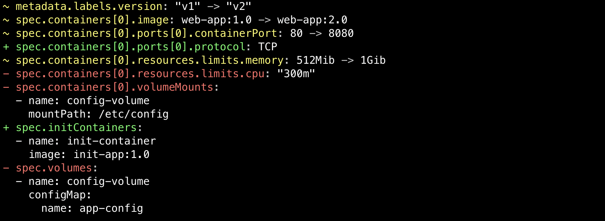
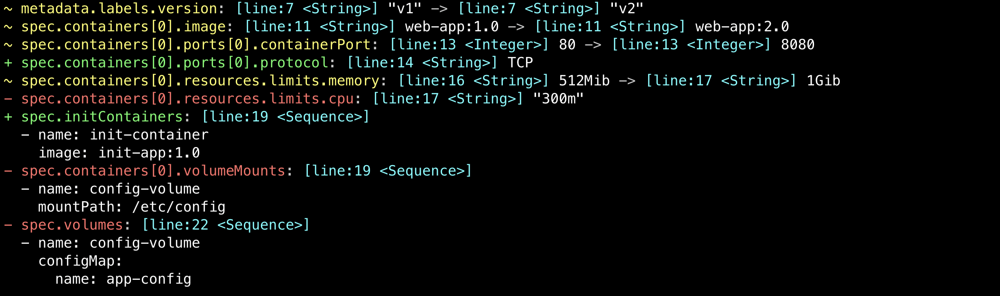

# yamldiff

yamldiff is a utility tool for performing structural comparisons on YAML files, helping you easily identify and understand differences between them.

It focuses on highlighting structural variations between two YAML files.



## Installation

```bash
$ go install github.com/semihbkgr/yamldiff@latest
```

Run with `help` flag to display a list of available options

```bash
$ yamldiff --help
structural comparison on two yaml files

Usage:
  yamldiff [flags] <file-left> <file-right>

Flags:
  -c, --comment     Include comments in the output when available.
  -e, --exit        Exit with a non-zero status code if differences are found between yaml files.
  -h, --help        help for yamldiff
  -m, --metadata    Include additional metadata in the output (not applicable with the silent flag).
  -p, --plain       Output without any color formatting.
  -s, --silent      Suppress output of values, showing only differences.
  -u, --unordered   Ignore the order of items in arrays during comparison.
  -v, --version     version for yamldiff
```

## Example

```bash
$ yamldiff --metadata examples/pod-v1.yaml examples/pod-v2.yaml
```



It can also be imported as a library in Go.

```go
func main() {
  left := []byte(`
name: Alice
city:  New York
items:
  - one
  - two
`)

  right := []byte(`
name: Bob
value: 990
items:
  - one
  - three
`)

  diffs, err := diff.Compare(left, right, false, diff.DefaultDiffOptions)
  if err != nil {
    panic(err)
  }

  output := diffs.Format(diff.FormatOptions{
    Plain:    true,
    Silent:   false,
    Metadata: false,
  })
  fmt.Println(output)
}
```

```out
~ name: Alice -> Bob
- city: New York
+ value: 990
~ items[1]: two -> three
```
