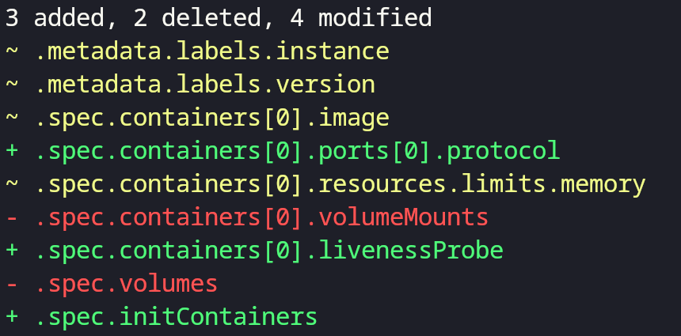

# yamldiff

[](https://pkg.go.dev/github.com/semihbkgr/yamldiff)
[](https://github.com/semihbkgr/yamldiff/actions/workflows/ci.yaml)
[](https://codecov.io/gh/semihbkgr/yamldiff)

`yamldiff` is a utility tool for comparing YAML files and highlighting structural changes with clarity and precision. It produces clear visual output that shows exactly what has been added, removed, or modified, making it easier to track configuration updates, analyze deployment differences, and debug YAML structures.


## Key Features

- **Structural comparison** - Detects changes in YAML data structure, layout, and values
- **Rich visual output** - Colored diff display with customizable formatting  
- **Flexible reporting** - Detailed diffs, path-only view, diffstat summary, or metadata including line numbers and value types
- **Library support** - Import as a Go module for programmatic use

## Installation

Install `yamldiff` using Go's package manager:

```bash
go install github.com/semihbkgr/yamldiff@latest
```

## Quick Start

Compare two YAML files with a simple command:

```bash
yamldiff file1.yaml file2.yaml
```

For a complete list of options and flags:

```bash
yamldiff --help
```

## Usage

```text
structural comparison on two yaml files

Usage:
  yamldiff [flags] <file-left> <file-right>

Flags:
      --color string   When to use color output. It can be one of always, never, or auto. (default "auto")
  -e, --exit-code      Exit with non-zero status code when differences are found
  -h, --help           help for yamldiff
  -i, --ignore-order   Ignore sequence order when comparing
  -m, --metadata       Include line numbers and node types (mutually exclusive with --path-only)
  -p, --path-only      Show only paths of differences without values
  -s, --stat           Show only diffstat summary (added, deleted, modified counts)
  -v, --version        version for yamldiff
```

## Examples

### Basic Comparison with Metadata

```bash
yamldiff --metadata examples/pod-v1.yaml examples/pod-v2.yaml
```


### Path-Only View

```bash
yamldiff --path-only examples/pod-v1.yaml examples/pod-v2.yaml
```



### Additional Examples

```bash
# Ignore sequence order when comparing arrays
$ yamldiff --ignore-order config1.yaml config2.yaml

# Show only diffstat summary (no diff details)
$ yamldiff --stat deployment-old.yaml deployment-new.yaml

# Exit with non-zero code if differences found (useful for CI/CD)
$ yamldiff --exit-code expected.yaml actual.yaml
```

## Library Usage

The `yamldiff` package can be integrated into your Go applications for programmatic YAML comparison:

```go
package main

import (
    "fmt"
    "github.com/semihbkgr/yamldiff/pkg/diff"
)

func main() {
    left := []byte(`
name: Alice
city: New York
items:
  - one
  - two
`)

    right := []byte(`
name: Bob
value: 990
items:
  - one
  - three
`)

    diffs, err := diff.Compare(left, right)
    if err != nil {
        panic(err)
    }

    fmt.Println(diffs.Format(diff.Plain))
}
```

**Output:**

```text
~ .name: Alice → Bob
- .city: New York
+ .value: 990
~ .items[1]: two → three
```

### API Reference

For detailed API documentation, visit [pkg.go.dev](https://pkg.go.dev/github.com/semihbkgr/yamldiff).

## Contributing

Contributions are welcome! Please feel free to submit a Pull Request. For major changes, please open an issue first to discuss what you would like to change.

## License

This project is licensed under the MIT License - see the [LICENSE](LICENSE) file for details.
