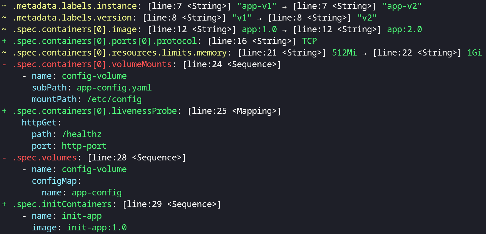

# yamldiff

yamldiff is a utility tool that applies a structural comparison on yaml files, making it easier to identify and understand the differences between them.

It basically compares the structural differences between two yaml files.


## Installation

```bash
$ go install github.com/semihbkgr/yamldiff@latest
```

Run with `help` flag to display a list of available options

``` bash
$ yamldiff --help

yamldiff is a tool for comparing the structural differences between two yaml files

Usage:
  yamldiff <file-left> <file-right> [flags]

Flags:
  -c, --comment    display comments in the output
  -e, --exit       returns non-zero exit status if there is a difference between yaml files
  -h, --help       help for yamldiff
  -i, --ignore     ignore indexes in array
  -m, --metadata   include metadata in the output (not work with silent flag)
  -p, --plain      uncolored output
  -s, --silent     print output in silent ignoring values
  -v, --version    version for yamldiff

```

## Example

```bash
$ yamldiff --metadata examples/pod-v1.yaml examples/pod-v2.yaml
```


