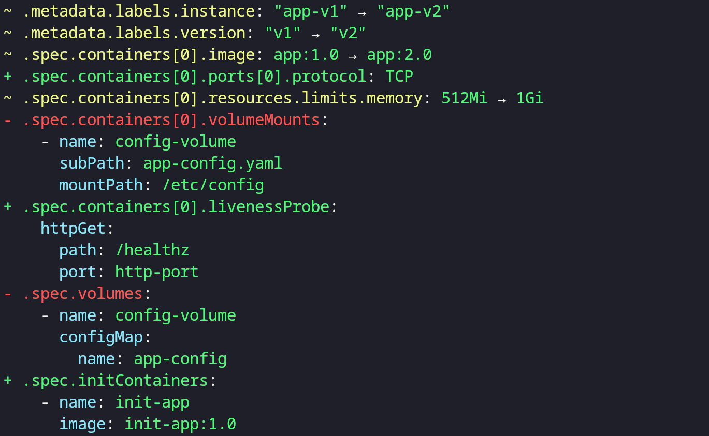

# yamldiff

`yamldiff` is a utility tool designed for comparing the structure of YAML files. It helps you quickly identify and understand differences between them by highlighting structural variations in a clear and concise way.



## Installation

```bash
$ go install github.com/semihbkgr/yamldiff@latest
```

Run with `help` flag to view a list of available options.

```bash
$ yamldiff --help
structural comparison on two yaml files

Usage:
  yamldiff [flags] <file-left> <file-right>

Flags:
      --color string   When to use color output. It can be one of always, never, or auto. (default "auto")
  -c, --counts         Display a summary count of total added, deleted, and modified items
  -e, --exit-code      Exit with non-zero status code when differences are found
  -h, --help           help for yamldiff
  -i, --ignore-order   Ignore sequence order when comparing
  -m, --metadata       Include additional metadata such as line numbers and node types in the output
  -p, --paths-only     Show only paths of differences without displaying the values
  -v, --version        version for yamldiff
```

## Example

```bash
$ yamldiff --metadata examples/pod-v1.yaml examples/pod-v2.yaml
```


## Library

The `yamldiff` module can also be imported as a library in Go, allowing you to integrate YAML comparison functionality into your own applications.

```go
func main() {
  left := []byte(`
name: Alice
city: New York
items:
  - one
  - two
`)

  right := []byte(`
name: Bob
value: 990
items:
  - one
  - three
`)

  diffs, err := diff.Compare(left, right, false, diff.DefaultDiffOptions)
  if err != nil {
    panic(err)
  }

  output := diffs.Format(diff.FormatOptions{
    Plain:    true,
    Silent:   false,
    Metadata: false,
  })
  fmt.Println(output)
}
```

```out
~ name: Alice -> Bob
- city: New York
+ value: 990
~ items[1]: two -> three
```
